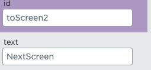
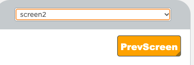
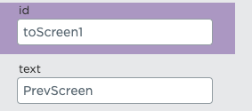

https://studio.code.org/projects/applab/vPjJZvhQptz1qKcgLZ_Dgh_agnkiaYlkxi-7iQQ5Bjk

# Weiterentwicklung der Cookie Clicker App

# Next Screen

Wir haben einen Button erstellst (siehe Bild), der auf einen anderen Screen verweist.


Dieser Button kriegt die Id "toScreen2" und einen Text. (siehe Bild)



Dann haben wir den folgenden Code dazu geschrieben:

###

```js
onEvent("toScreen2", "click", function () {
  setScreen("screen2");
});
```

Wir erstellen einen onEvent. Dieser soll aufgerufen werden wenn "toScreen2" gecklickt wurde. In dieser aufgerufenen Funktion rufen wir einen neuen Screen auf. Den ahben wir uns natürlich voher erstellt. In diesem Fall wird "screen2" aufgerufen

# Prev Screen

Nachdem wir auf eienen zweiten Screen verweisen können, machen wir das gesamte noch einmal rückwärts.

Dafür setzen wir wieder einen Button mit den folgenden Parametern:





Dann haben wir dazu den folgenden Code geschrieben:
(es ist alles das gleiche wie beim nextScreen, nur das wir die Parameter umschreiben müssen).

###

```js
onEvent("toScreen1", "click", function () {
  setScreen("screen1");
});
```
