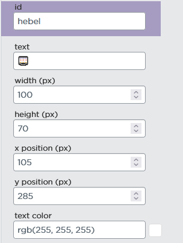
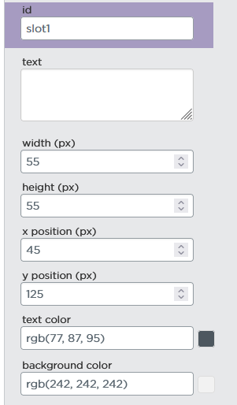
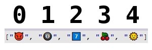
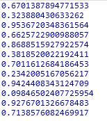
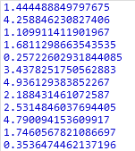
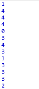
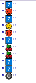

https://studio.code.org/projects/applab/Ck2ZQJwunOZ72K2jwxLmxwMPaF6n77ruKzITAJ6xNe0

# Slotmachine App

## Wiederholung Felder
Wir wollen ein Feld mit Symbolen erstellen, die nachher in den Slots unserer Slot machine erscheinen:

```js
var symbole = ["😈", "🎱", "7️⃣", "🍒", "🌞"]
```
_(wir können in Windows mit Windowstaste + "."-Taste das Emoji-Menü so Emojis eingeben, diese können wir wie einfache Sätze oder Wörter zuvor in Anführungzeichen setzen, sodass sie als Zeichenkette verstanden werden)_


### (Wichtig: Die Elemente im Feld werden in eckigen Klammern [] und nciht in runden Klammern angegeben)

#
Im App Entwurf können wir nun einen einfachen Button "Hebel" und eine Textarea "Slot1" (für den ersten der drei Slots unserer Slot Machine) einfügen:




Wir erinnern uns daran, dass die Elemente in einem Feld alle einen Index (eine Art "Hausnummer") haben, womit die Elemente aufgerufen werden können. Dabei wird vom ersten bis zum letzen Element bei 0 beginnend durchnummeriert.

Das sieht dann in unserem Feld so aus:


Mithilfe des Index können wir ein Element an einer bestimmten Stelle erhalten. Also wenn wir die Zeichenkette, die bei uns die Krische enthält erhalten wollen, können wir dieses mit dessen Index 3 erhalten: 

```js
console.log( symbole[3] )
```
#
## Erstellen von Zufallszahlen
Um nun in einem Slot ein zufälliges Symbol zu erhalten bräuchten wir bei jedem neuen Spiel eine zufällige Zahl zwischen 0 (dem ersten Index unseres Feldes) und in diesem speziellen Fall 4 (der letzte Index unserers Feldes)

Mit der Funktion Math.random() können wir zunächst eine zufällige Kommazahl von 0 bis 0,999999999999999999999999 (bis kurz vor die Eins, aber keine Eins :) ) erhalten:

```js
console.log( Math.random() )
```


Das hat den Vorteil, dass wir diese Zahl nun mit jeder beliebigen Zahl multiplizieren können (z.B. 10) und so Zufallszahlen von 0 bis zu dieser (z.B. 10) erhalten. Für unser Projekt können wir hier die Länge unseres "symbole"-Feldes folgendermaßen nehmen:

```js
console.log( Math.random() * symbole.length )
```


=> Wir erhalten Zufallszahlen von 0 bis 4,9999999999999...

Da wir aber noch Kommazahlen erhalten, unsere Indizes _(Plural von "Index" ist "Indizes", kleiner FunFact am Rande :)) )_ aber nur natürliche Zahlen sind (genauso wie man in Häusern mit Hausnummern 3 oder 6 lebt aber nicht nicht in 3,32768 oder 10,21638), müssen wir diese zahlen noch abrunden:

```js
console.log( Math.floor( Math.random() * symbole.length ) )
```


### (Wichtig: Wir erhalten von dem Paket "Math.random() * symbole.length" eine Zahl, die wir dann in die Funktionsklammern von der Math.floor Funktion als Parameter einsetzen.)

_(Wir verweden "Math.floor" um abzurunden (floor = Boden ~> nach unten) und nicht "Math.ceil" zu aufrunden (ceil -> ceiling = Decke ~> nach oben), da wir Zahlen von 0 (erster Index) bis 4 (letzter Index) erhalten wollen. "Mit Math.ceil" würden wir Zahlen von 1 bis 5 erhalten.)_

Wenn wir diese Zufallszahl nun als Index dort angeben, wo wir eben im Beispiel für die Kriche fest die "2" stehen hatten, erhalten wir jedes mal ein zufälliges Symbol:

```js
console.log(symbole[ Math.floor(Math.random() * symbole.length) ])
```


#
Wir wollen ja eine Zufallszahl erstellen, wenn wir den Hebel drücken um eine Runde zu spielen, das heißt wir brauchen die altbekannte "onEvent" Methode, die wir bereits vom Cookie Clicker kennen:

```js
onEvent("hebel","click", function(){

})
```

Jedes mal wenn diese Funktion läuft, wollen wir eine neue Zufallszahl erstellen und in einer Variable speichern, damit wir sie benutzen können:
```js
onEvent("hebel","click", function(){
  var value1 = Math.floor(Math.random() * symbole.length)
})
```

Mit der "setText" Methode, die wir auch bereits vom Cookie Clicker kennen, können wir nun das zufällige Symbol ins Textfeld setzen:
```js
onEvent("hebel","click", function(){
  var value1 = Math.floor(Math.random() * symbole.length)
  
  setText("slot1", symbole[value1])
})
```
#
### 3 Slots:
In einer Slot machine haben wir drei Slots. Für jeden der drei Slots soll die gleiche Logik gelten, also können wir einfach wie oben zwei neue Textareas, jedoch mit den IDs "slot2" und "slot3" erstellen und den bisherigen Code kopieren und etwas abändern um so drei Slots, in denen nach Betätigen des Hebels jeweils zufällige Symbole erscheinen, zu erhalten:

```js
onEvent("hebel","click", function(){
  var value1 = Math.floor(Math.random() * symbole.length)
  var value2 = Math.floor(Math.random() * symbole.length)
  var value3 = Math.floor(Math.random() * symbole.length)
  
  setText("slot1", symbole[value1])
  setText("slot2", symbole[value2])
  setText("slot3", symbole[value3])
})
```
