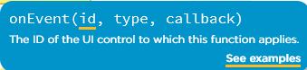
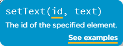
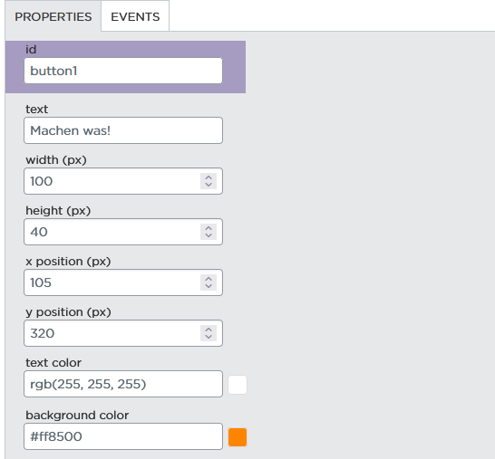
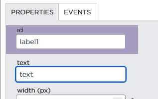

https://studio.code.org/projects/applab/sWCY83FShbx_SdQP-sTZxbM9FHk5wcqBbei-KTl6QRM

# Wiederholung: Variablen und die Konsole
###
```js
var name = "Albert"
var lieblingsFach = "Informatik"
console.log("Hallo mein Name ist "+ name +" und ich mag gerne "+ lieblingsFach +".")
```

Wir können einer Variable Werte zu weisen (Variable ~wie eine Tupperdose, in die wir Zettel mit Namen oder so reinlegen können):
###
```js
name = "Alfonso"
lieblingsFach = "Musik"
console.log("Hallo mein Name ist "+ name +" und ich mag gerne "+ lieblingsFach +".")
```
=> Können diese Werte ändern und erhalten von der gleichen Zeile Code eine andere Ausgabe

# Funktionen
Aber das ist ja irgendwie doof, dass wir das jedes mal alles ausführen was da steht :o das geht doch bestimmt besser
=> Dafür gibt es Funktionen:
###
```js
function katze(){
  console.log("miau")
}
```
=> Es passiert nichts wenn wir das Programm laufen lassen, aber das soll so sein
Können diese Methode jetzt aufrufen:
###
```js
katze()
```

Praktischer, wenn man längere Sachen hat:
###
```js
function druckeNamen(){
  var name = "Albert"
  var lieblingsFach = "Informatik"
  console.log("Hallo mein Name ist "+ name +" und ich mag gerne "+ lieblingsFach +".")
  
  name = "Alfonso"
  lieblingsFach = "Informatik"
  console.log("Hallo mein Name ist "+ name +" und ich mag gerne "+ lieblingsFach +".")
}

druckeNamen()
```

Wenn wir das jetzt oft oder man mehreren Stellen machen wollen, können wir die Methode einfach nur aufrufen ohne die vielen Zeilen ständig zu kopieren:
###
```js
druckeNamen()
druckeNamen()
druckeNamen()
druckeNamen()
```

Funktionsparameter: Können Funktionen variabler machen
=> Funktionsparameter ~eine Variable, die nur in der Funktion gilt

###
```js
function druckeTierGeraeusch(geraeusch){
  console.log("Hallo, ich bin ein Tier und ich mache: " + geraeusch)
}

druckeTierGeraeusch("wuff")
druckeTierGeraeusch("miau")
druckeTierGeraeusch("aye caramba")
```

=> console.log() ist auch eine Funktion, die uns von JavaScript gegeben ist, dass was wir immer da eingegeben haben ist der Parameter (das, was dann am Ende ausgedruckt wird

  
# Button und Label 
*(eher spezifisch für App Entwicklung, aber generell praktisch)*

Auch dieser Button (Knopf) hat eine Funktion, die von JS gegeben ist, sie heißt "onEvent"
3 Parameter: Id (des Buttons), Typ (click, mouseover…) Funktion (was soll getan werden?)

###
```js
onEvent("button1", "click", druckeNamen)
```

=> Hier sehen wir auch nochmal, warum es so praktisch ist, Funktionen zu haben:
Konsole ist ja irgendwie doof, wir wollen das ja auf dem Handy sehen
Label, hat auch eine Funktion, "setText", wir schauen uns an, was sie haben will:


###
```js
function zeigeAufHandy(text){
  setText("label1", text)
}

onEvent("button1", "click", function(){zeigeAufHandy("Holá!")})
```


