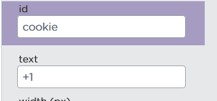
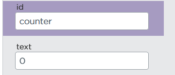

https://studio.code.org/projects/applab/7tqjdEPW8cnA-XkWxklG3OKz9ZI1-AguIrxPc6tyhto

# Cookie Klicker App
## Rechnen

### 
```js
console.log("1" + "2")
console.log(1 + 2)
```

Wenn wir Zahlen nicht als Zeichenkette mit Anführungszeichen angeben sondern einfach als Zahl, können wir damit in unserem Programm Berechnungen machen

Können hier Variablen benutzen um Berechnungen zu automatisieren:

###
```js
var counter = 0

function addiere(){
  counter = counter + 1
  console.log(counter)
}

onEvent("cookie","click", addiere)
```

(Nach Erstellen eines Buttons mit der id "Cookie")



Wenn wir den Druck in die Konsole jetzt mit einer setText-Funktion für ein Label austauschen, haben wir ein Cookie Klicker Spiel:

###
```js
var counter = 0

function addiere(){
  counter = counter + 1
  setText("counter", counter)
}

onEvent("cookie","click",addiere)
```


