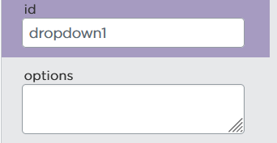
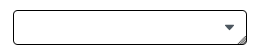
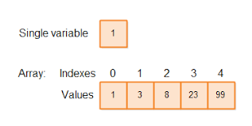
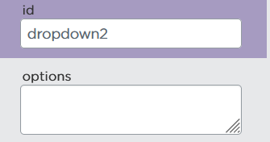

https://studio.code.org/projects/applab/fv6BRsHK-fjm5QLlg9cgZiDdup0dDeiq4YaKQn3OU-8

# Weiterentwicklung der Cookie Clicker App

## Dropdown Menüs (App-Entwicklung)




Ein Menü mit mehreren Optionen zum Auswählen durch anklicken

## Felder _(engl. Array)_
###
```js
var summanden = [1, 10, 100, 10000000000]
```

In einem Feld können wir mehrere Werte in einer Variable speichern, diese werden mit Kommas getrennt, die Menge an Werten wird eckigen Klammern angegeben

Jedes Element in diesem Feld besitzt einen "Index", vom ersten bis zum letzten Element wird ab 0 durchgezählt



(Können das kurz ausprobieren mit:)
###
```js
console.log(summanden[0])
console.log(summanden[3])
```

Wir benutzen Felder in der Regel um mehrere zusammengehörige Werte in einer Variable speichern zu können, etwa alle Optionen für ein Dropdownmenü:
###
```js
setProperty("dropdown1", "options", summanden)
```
Mit der JavaScript-Funktion "setProperty" können wir das Feld, was wir grade erstellt haben den Optionen des Dropdowns zuweisen.

Wenn wir unserer Addieren-Funktion jetzt einen Parameter geben, können wir die Zahl, die nach jedem Klick addiert wird anpassen:

###
```js
function addiere(summand){
  counter = counter + summand
  setText("counter", counter)
}
```

Mit "getNumber" können wir die ausgewählte Zahl im Dropdown erhalten und sie der Addieren-Funktion beim Aufruf als Parameter übergeben:

###
```js
onEvent("cookie", "click", function(){
  var summand = getNumber("dropdown1") 
  addiere(summand)
})
```

## Bedingungen
Wir machen ein zweites Dropdown-Menü:



###
```js
setProperty("dropdown2", "options", ["+", "*"])
```

(Wir wollen auswählen, ob die Zahl addiert oder multipliziert werden)

Mit if(){} können wir den Wert einer Variable überprüfen. Nur wenn eine bestimme Bestimmung erfüllt ist wird der Code in den geschweiften Klammern ausgeführt. Können je nach Zustand des Dropdowns nun die Zahl entweder addieren oder multiplizieren:

###
```js
function rechne(zahl, typ){
  if(typ === "+"){
    counter = counter + zahl
  } else if(typ === "*"){
    counter = counter * zahl
  }
  
  setText("counter", counter)
}
```

Jetzt müssen wir noch die onEvent Funktion des Buttons anpassen:

###
```js
onEvent("cookie", "click", function(){
  var zahl = getNumber("dropdown1")
  var typ = getText("dropdown2")
  rechne(zahl, typ)
})
```